# TypeCore

An object-based operating system where everything — files, devices, services, permissions — is an object. No file paths. No file descriptors. No inherited UNIX baggage. Just objects, messages, and capabilities.

## Why

Operating systems still run on abstractions from the 1970s. Files are unstructured byte streams. Permissions are bolted-on access control lists. Every layer of security is a patch on a model that never had isolation as a first-class concept.

TypeCore starts over.

**Objects, not files.** A photo isn't a bag of bytes at `/home/user/photo.jpg` — it's a Photo object with structured fields and methods. The OS understands what it contains.

**Capabilities, not permissions.** Access is a cryptographic key that grants specific operations on a specific object. No key, no access. No path traversal attacks because there are no paths.

**Messages, not syscalls.** Objects communicate by sending messages. The kernel routes them, checks capabilities, and gets out of the way.

**Hard real-time, not best-effort.** Any object can request guaranteed CPU time with deadline scheduling. Same kernel, same IPC, same security model.

## Architecture

  

## Product Family

| Component            | Description                                   |
|----------------------|-----------------------------------------------|
| **TypeCore OS**      | The full operating system                     |
| **TypeCore Kernel**  | Microkernel with capability security          |
| **TypeCore Runtime** | Object runtime — type dispatch, async, policy |
| **TypeCore Stdlib**  | Standard types, interfaces, and utilities     |

## Status

Design phase. Code is coming.

## Links

- Website: [typecore.tech](https://typecore.tech)
- Organization: [github.com/typecore-tech](https://github.com/typecore-tech)
